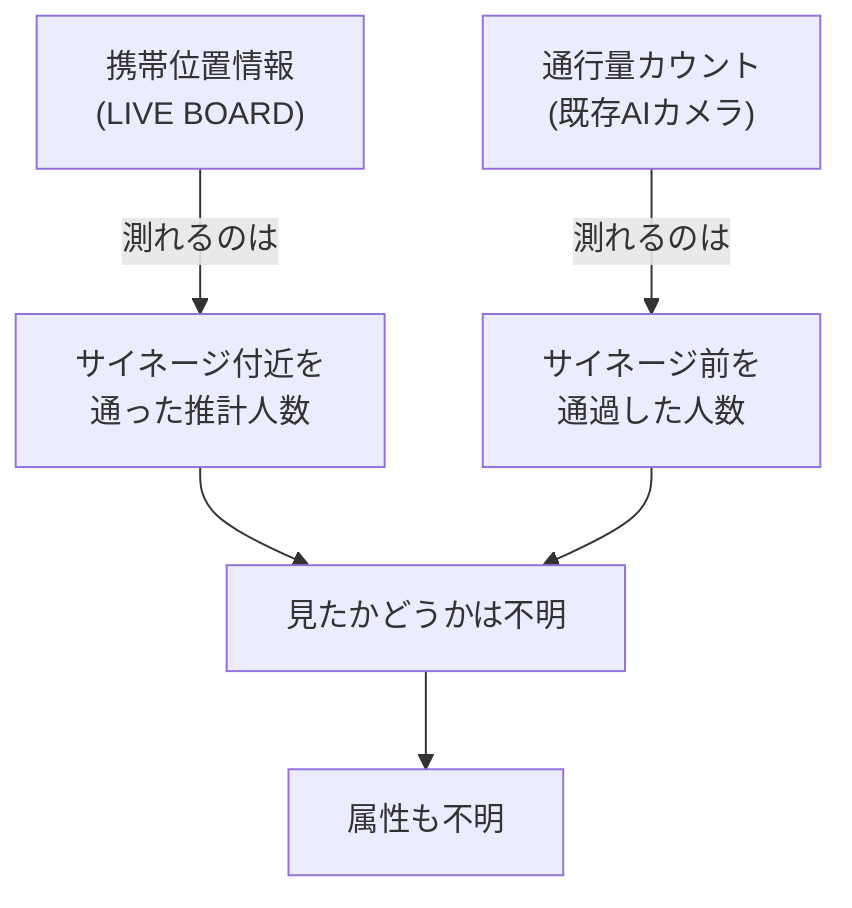
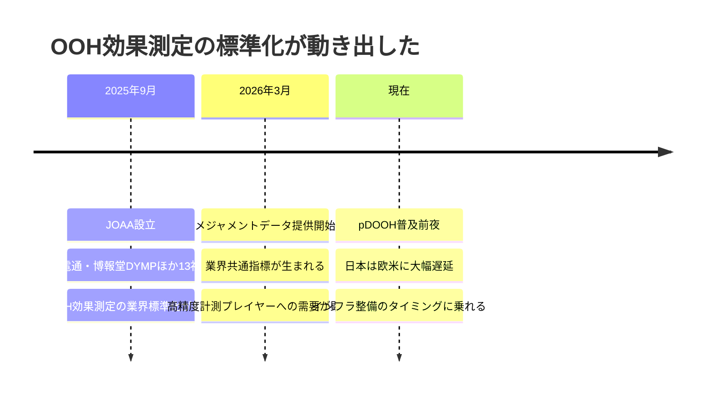
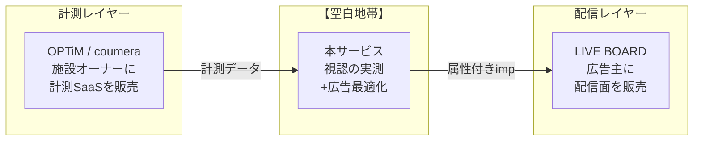
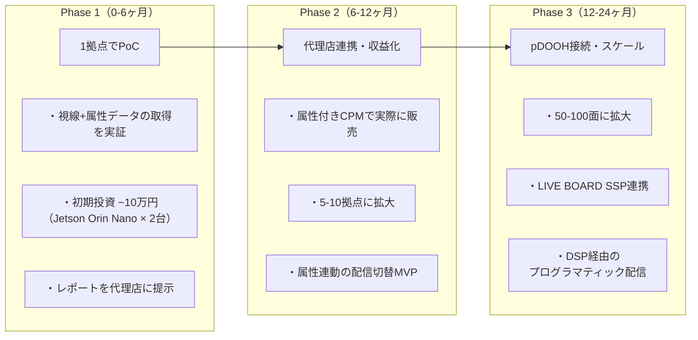

# スライドドラフト: AI視線トラッキング × OOH広告最適化

generated_at: 2026-02-23
source: strategy_ad_optimization.md

---

## Slide 1 — OOH広告とは

**タイトル**: OOH広告（Out-of-Home）— 家の外で目にするすべての広告

### レイアウト

- **上部**: タイトル + サブタイトル
- **中央**: 画像4枚を横並び（OOHの代表的な形態）
- **下部**: 市場規模の数値3つを大きく表示

### 画像配置（中央、横4列）

| 画像1 | 画像2 | 画像3 | 画像4 |
|---|---|---|---|
| 渋谷スクランブル交差点の大型ビジョン | 駅構内のデジタルサイネージ | 商業施設内のフロアサイネージ | タクシー後部座席のモニター広告 |
| **大型ビジョン** | **交通広告** | **施設内サイネージ** | **モビリティ広告** |

> 画像ソース候補: Unsplash / PIXTA で「渋谷 ビジョン」「駅 デジタルサイネージ」「shopping mall signage」「taxi ad screen」等で検索

### テキスト

**サブタイトル**: 街頭の大型ビジョン、駅のデジタルサイネージ、商業施設のモニター、タクシー広告 — 生活動線上で自然に目に入る広告メディア

**補足説明（画像下に1-2行）**:
- Web広告と異なり、広告ブロッカーで消されない。物理空間にいる人に確実にリーチできる
- 特にデジタルOOH（DOOH）は動画・リアルタイム配信が可能で、Webに次ぐ成長メディアとして注目

**下部 — 数値3つを大きく表示**:

| 数値 | ラベル |
|---|---|
| **4,487億円** | 日本のOOH広告市場（2024年） |
| **1,110億円** | うちデジタルOOH（2025年見込み, YoY +16%） |
| **1,647億円** | DOOH市場予測（2030年） |

---

## Slide 2 — 課題と解決策

**タイトル**: OOH広告の「見えない」を、見えるようにする

### レイアウト

- **上部**: タイトル
- **中央左**: 課題（広告主の痛み + 計測手法の比較フロー）
- **中央右**: 解決策（視線トラッキングの仕組みフロー）
- **下部帯**: 「なぜ今か」のタイムライン

### 中央左 — 課題

**見出し**: 広告主の痛み

**キーメッセージ（大きめフォント）**:
> 「OOHに出稿したいが、効果が見えないから社内で予算を通せない」

**既存の計測手法の限界（縦フローチャート）**:



**補足テキスト**: デジタル広告では「誰が」「何回」「見たか」が当たり前に計測できる。OOH広告ではその基本指標すら存在しない。

### 中央右 — 解決策

**見出し**: 視線トラッキング × 属性推定

**仕組みフロー（縦フローチャート）**:

```mermaid
graph TD
    A["サイネージにカメラを1台設置"] --> B["通行者の顔・視線を検出"]
    B --> C{"サイネージを<br>見ているか？"}
    C -->|見ている| D["属性を推定<br>年齢・性別"]
    C -->|見ていない| E["カウントしない"]
    D --> F["視認インプレッション<br>として記録"]
    F --> G["「30代女性が<br>1日320回 "見た"」"]
```

**補足テキスト**: 推計ではなく「見た」ことを視線で確認した実測データ。映像はエッジ処理で即時破棄し、統計データのみを送信。

### 下部帯 — なぜ今か（横タイムライン）



---

## Slide 3 — ビジネスモデルと展開

**タイトル**: 広告効果の実測で、全員が得するエコシステム

### レイアウト

- **上部**: タイトル
- **中央左**: ステークホルダーのフローチャート（お金と価値の流れ）
- **中央右**: ポジショニングマップ
- **下部**: Go-to-Market の3フェーズ

### 中央左 — ビジネスモデル（フローチャート）

```mermaid
graph TD
    subgraph 広告主・代理店
        A1["得られる価値:<br>・視認ベースのインプレッション<br>・属性別のリーチデータ<br>・デジタル広告と同粒度のレポート"]
    end

    subgraph 本サービス
        B1["提供機能:<br>・視線トラッキング<br>・属性推定（年齢・性別）<br>・視認imp計測・配信最適化"]
    end

    subgraph サイネージ設置場所
        C1["得られる価値:<br>・カメラ設置・運用が無料<br>・広告収益の分配を受け取る<br>・人流データの閲覧も可能"]
    end

    A1 -->|"属性付きCPMで支払い"| B1
    B1 -->|"レベニューシェア<br>（広告費の20-30%を収益化）"| B1
    B1 -->|"広告収益を分配"| C1
    C1 -->|"設置スペースを提供<br>（コスト: 0円）"| B1
```

**補足テキスト**:
- 広告主: 「30代女性が○回見た」という実測データで出稿判断。CPMにプレミアム30-50%を許容
- 本サービス: 広告費の20-30%をレベニューシェア。面数が増えるほどネットワーク効果でCPM単価が向上
- 設置場所: コスト0円でカメラを設置。広告収益が増加するインセンティブで参加

### 中央右 — ポジショニングマップ



**補足テキスト**: 計測SaaS（OPTiM / coumera）と配信PF（LIVE BOARD）の間に「視認実測 + 広告最適化」レイヤーが空白。人流分析プレイヤーは計測SaaSに閉じており、広告プレイヤーはカメラベースの実測を持っていない。この両者をつなぐポジションを取る。

### 下部 — Go-to-Market（3フェーズ、横並び）


